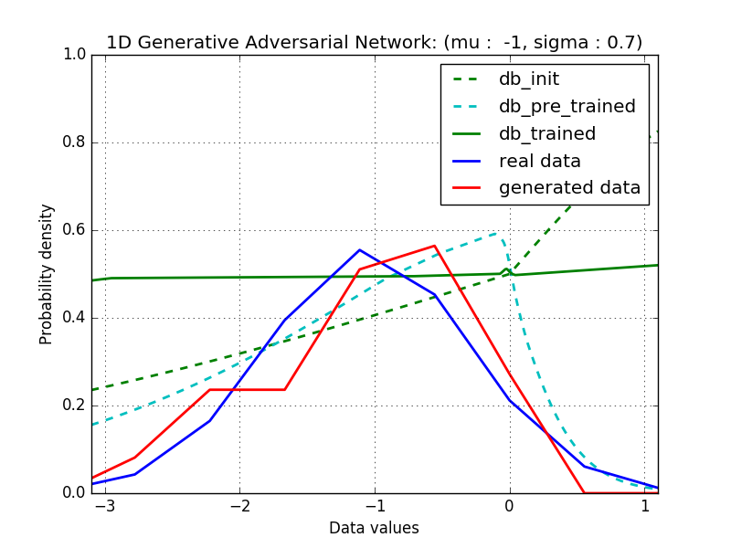
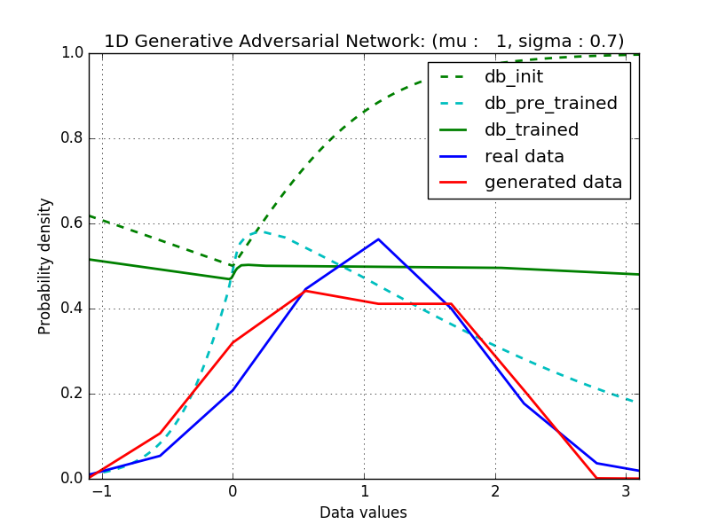
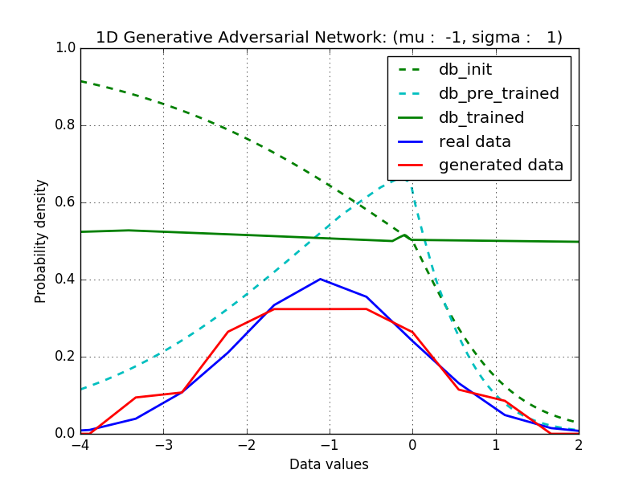
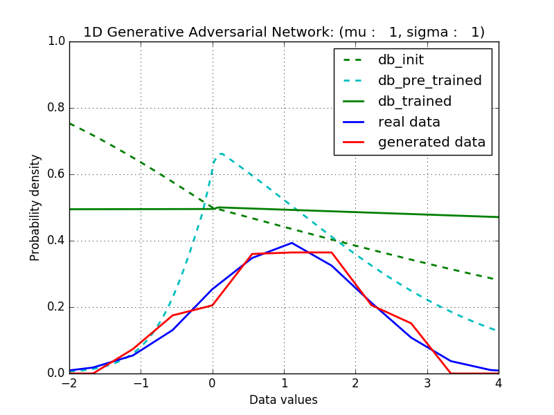
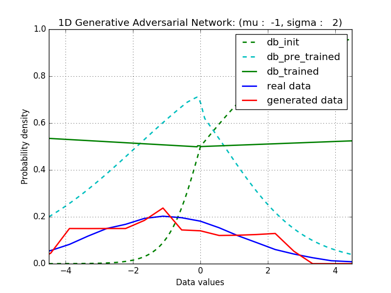
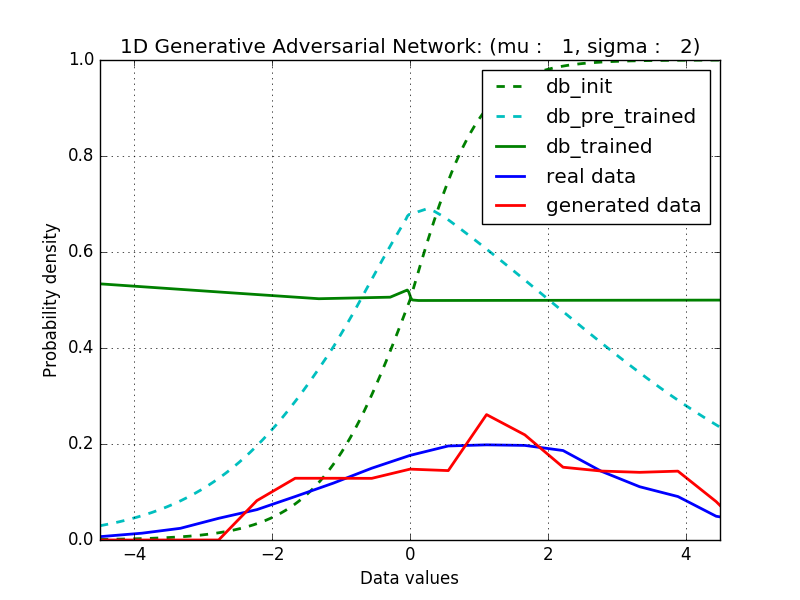

# Generative Adversarial Network for approximating a 1D Gaussian distribution
Tensorflow implementation of Generative Adversarial Network for approximating a 1D Gaussian distribution.

## Results

Desirable result of GAN is to have decision boundary (db) of one-half and probability distribution function (pdf) of generated data similar to the original pdf.

Through the following images, you can see that all of results for various 1D Gaussian distributions are well shaped.

<table align='center'>
<tr align='center'>
<td></td>
<td> mean = -1</td>
<td> mean = +1</td>
</tr>
<tr>
<td> stdev = 0.7</td>
<td>
<td>
</tr>
<tr>
<td> stdev = 1.0</td>
<td>
<td>
</tr>
<tr>
<td> stdev = 2.0</td>
<td>
<td>
</tr>
</table>

## References

The implementation is based on the projects:

[1] Project by Eric Jang : [BLOG](http://blog.evjang.com/2016/06/generative-adversarial-nets-in.html), [CODE](https://github.com/ericjang/genadv_tutorial)  
[2] Project by John Glober : [BLOG](http://blog.aylien.com/introduction-generative-adversarial-networks-code-tensorflow/), [CODE](https://github.com/AYLIEN/gan-intro)

## Acknowledgements
This implementation has been tested with Tensorflow r0.12 on Windows 10 and Ubuntu 14.04.
